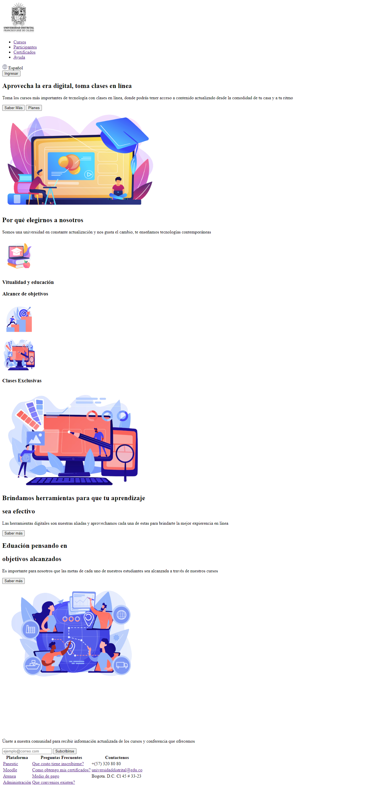
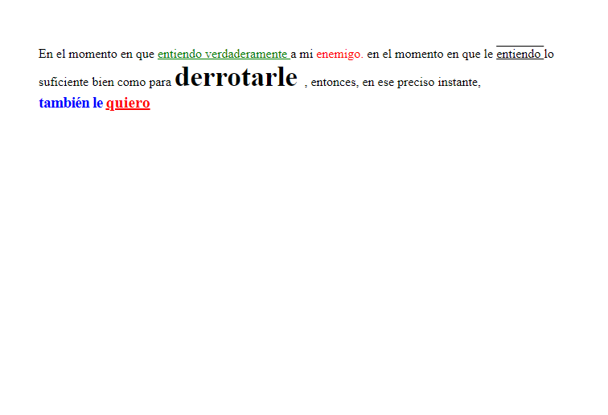
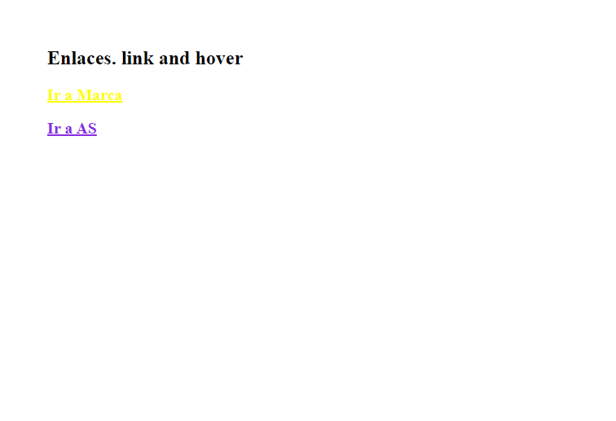
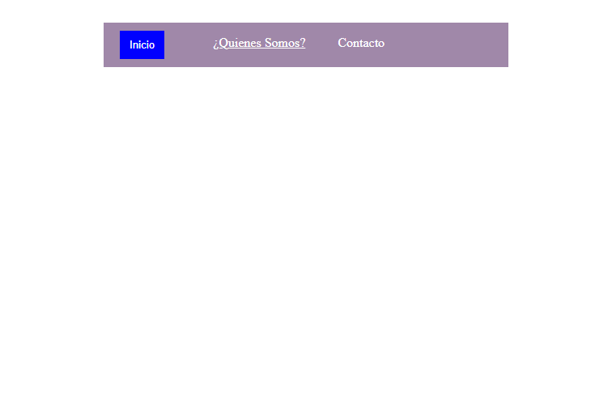
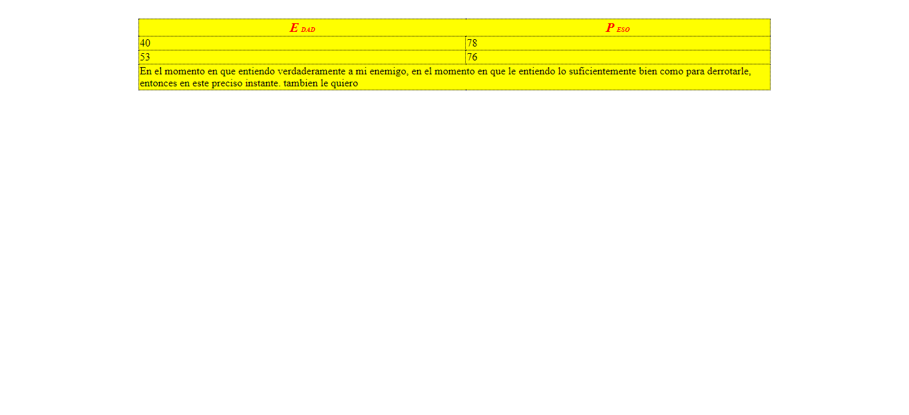

<h1>Taller 9: Saúl Guerrero</h1>

<h2>Información</h2>

Curso: Full Stack Basico - Grupo 1

Profesor: Cristian Patiño

Estudiante: Saúl Guerrero

<h2>Punto 1: link de figma</h2>
<a href="https://www.figma.com/file/yGFUPqoqfpL0JHTVJdfGSN/SAUL-GUERRERO?type=design&node-id=0%3A1&t=G1uKbORpCyYAl2c6-1">Link de figma</a>

 
<a href="https://saul-guerrero.github.io/taller-9-full-stack/">Link pagina</a>

<h2>Punto 2: html </h2>

<h2>Punto 3: CSS </h2>

<h2>Punto 4: html y CSS </h2>

<h2>Punto 5: html y CSS </h2>

<h2>Punto 6: html y CSS </h2>

<h2>Punto 7-8: html y CSS </h2>

<h2>Punto 9: html y CSS </h2>
 

<h2>Link del Repositorio </h2>
<link>https://github.com/Saul-Guerrero/taller-9-full-stack </link> 
